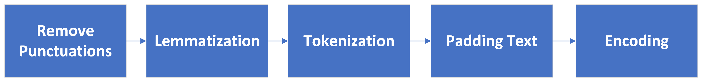
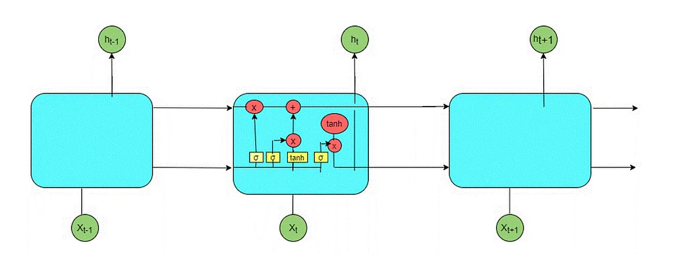
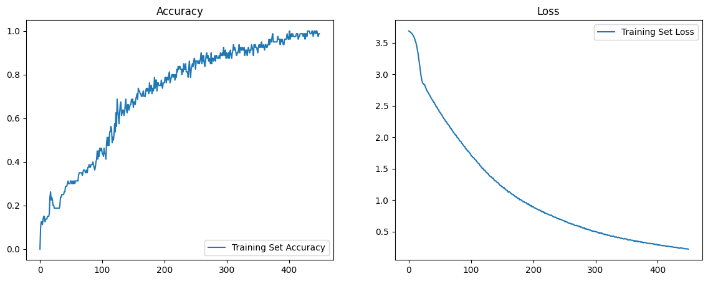

# Chatbot-Speech-Recognition
 A chatbot is a component of Natural Language Processing (NLP) used for conversations with users through text and speech. create an automated chat or chatbot regarding the Kampus Merdeka program from the Ministry of Education, Culture, Research, and Technology

 ## Preprocessing Data

<tr>
<td></td>
</tr>

## Long Short Term Memory (LSTM) Model

LSTM (Long Short-Term Memory) is a popular Deep Learning algorithm suitable for making predictions and classifications related to time and text data.

This algorithm can be considered a development or a type of Recurrent Neural Network (RNN) algorithm. In the RNN algorithm, the output from the last step is fed back as input to the current step. However, RNN has a limitation in that it cannot predict words stored in long-term memory.

LSTM is designed to overcome this weakness while retaining the advantages of the RNN algorithm, which can provide more accurate predictions based on the latest information.

The LSTM algorithm was first developed by Hochreiter and Schmidhuber. This algorithm can store information for a long period, which can then be used to process, predict, and classify information based on time series data.

The structure of the LSTM algorithm consists of a neural network and several different memory blocks. These memory blocks are referred to as cells. The state of the cell and the hidden state are passed to the next cell.

<tr>
<td></td>
</tr>

## Result & Evaluation

<tr>
<td></td>
</tr>

It is evident that training the chatbot model with the LSTM algorithm has yielded a good model without experiencing overfitting or underfitting. Therefore, this model is worthy of testing and evaluating the obtained chatbot model.

# Preview Testing

<tr>
<td></td>
</tr>

